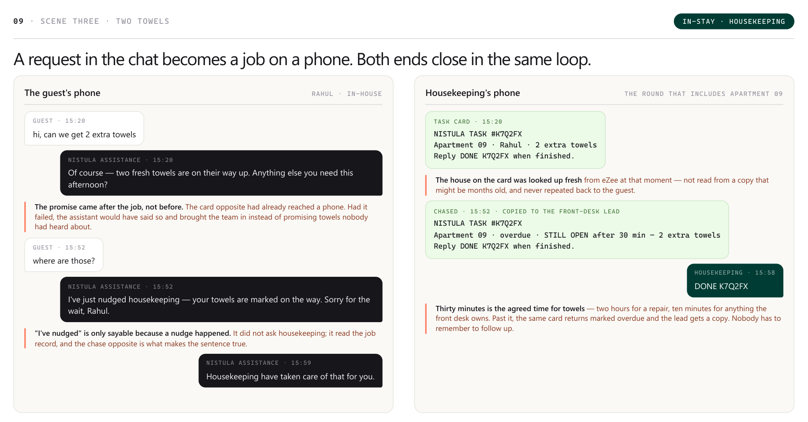
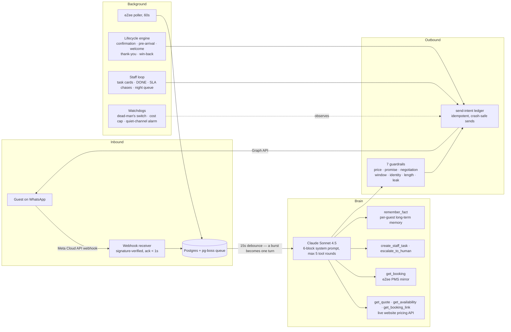
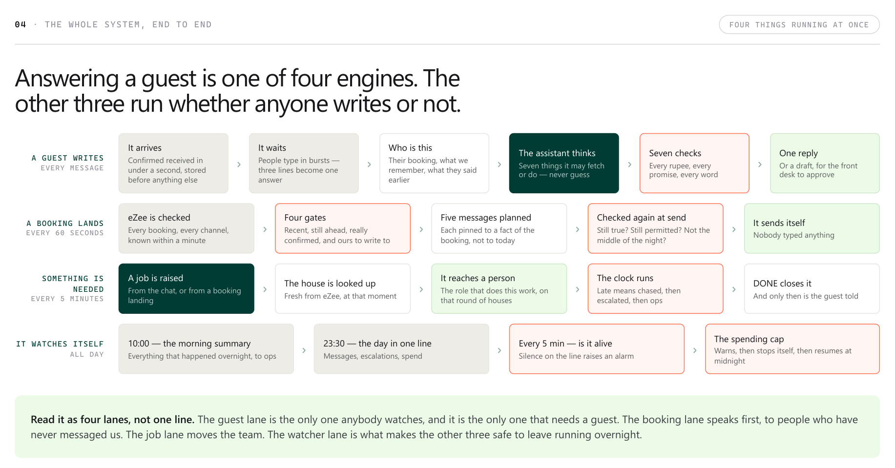
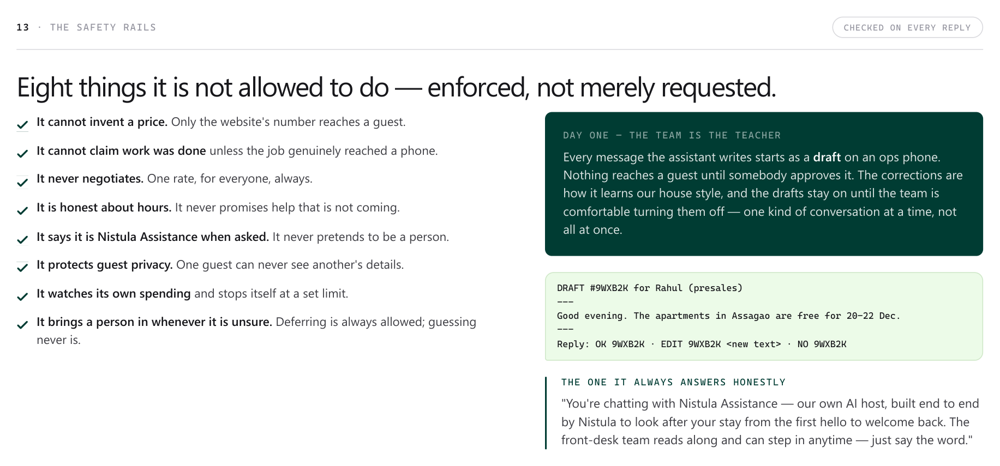
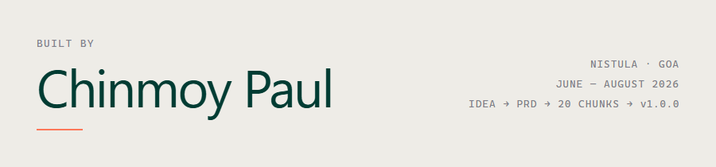

# Nistula Assistance

**A WhatsApp AI host for a boutique villa company in Goa — an agentic Claude application that quotes live prices, dispatches jobs to staff phones, and runs the guest lifecycle unprompted.**

I designed, built, tested and shipped it solo: problem statement → research → PRD → a 973-line build plan → 20 chunks → a tagged `v1.0.0` (first commit 7 July 2026, released 22 July), verified live on a WhatsApp test line. Claude is both the LLM inside the product and the pair I built it with — the workflow that made that safe is documented [below](#how-it-was-built--an-ai-native-workflow).

  

> A guest asks for towels at 15:20. The assistant answers, a job card lands on the right staff phone, staff reply `DONE`, and the guest is told — one loop, no human coordination, and the assistant is only allowed to say "on their way" because the card verifiably reached a phone.

| | | | | |
|---|---|---|---|---|
| **1,813** automated tests | **7** guardrails on every reply | **6** scripted scenarios replayed in CI | **50k** lines of TypeScript 23k app · 27k tests | **0** prices the model may invent |

---

## What it is

A small villa company ran its entire guest relationship — enquiry, booking, stay, follow-up — by hand on one WhatsApp number, with a front desk that goes home at 20:00. Nistula Assistance is that number's AI host, and it does three things:

- **Answers guests end to end** — pre-sales enquiries with live prices, in-stay service requests, arrival logistics, post-stay follow-ups — in the company's own voice, at any hour.
- **Never invents a price or a promise** — every rupee comes from the same quote API the company's website itself calls, every booking fact from the PMS mirror, everything else from a curated knowledge base. Both rules are enforced in code after the model writes, not requested of it in a prompt. Unknown means "let me bring the team in", never a guess.
- **Gives the AI hands** — guest requests become task cards on staff phones with SLA chasing and escalation; a human typing in the thread silences the AI instantly; nights are handled honestly instead of with false promises.

---

## Architecture

**In words:** messages arrive on a signature-verified webhook and are stored before anything thinks. A debounced worker turns message bursts into single turns. Claude reasons with six context blocks (identity, voice, knowledge, rules, guest profile, situation) and drives an agentic tool loop — seven typed tools behind function calling, capped at five rounds, covering live pricing, PMS lookups, staff dispatch and memory. Every draft then passes seven deterministic guardrails before a send-intent row makes delivery idempotent. Around the conversation loop run three more independent engines — a PMS poller, a lifecycle scheduler, and the staff task loop — with watchdogs and cost telemetry over all of it.

  

---

## Engineering highlights

**Price integrity as an architectural rule.** The AI cannot state a price it did not fetch. Guardrail 1 scans every outgoing rupee figure and traces it to a tool result or a whitelisted knowledge-base fee; an untraceable figure kills the send and regenerates the reply. The pricing source is the company website's own quote API, so chat and website can never disagree.

**Promise integrity.** "I've told housekeeping" is only sayable if a task verifiably reached a staff phone this turn. The guardrail parses promise-shaped verbs and demands a matching successful tool call — otherwise the reply is rewritten. No theatre.

**Idempotent delivery (send-intent pattern).** Every outbound message is committed to the database as an intent *before* the network call. Crashes, retries and redeploys can never double-send — the ledger, not the process, owns delivery state.

**Honest nights.** Staff work 10:00–20:00. At 23:00 the assistant does not promise "someone is on their way" — it raises the request as a `night_queue` task, tells the guest plainly that the team is in from 10:00, and holds the SLA clock off work nobody is rostered for. At 10:00 the morning digest converts the queue into live, assigned jobs and reports the night to ops in one message.

**Human takeover with zero UI.** Any staff reply in the guest's thread pauses the AI on that conversation for two hours; `AI OFF <last4>` holds it indefinitely and `AI ON` releases it. No button, no dashboard, no second app — the control surface is the WhatsApp staff already use. The design extends to Meta coexistence (Business app + Cloud API on one number, `smb_message_echoes` detection) for production cutover.

**Per-guest memory with a sensitivity screen.** Durable facts ("prefers early check-in", "celebrated an anniversary") persist across months, so returning guests are met known. A save-time screen refuses instruction-shaped or entitlement content ("always gives me 20% off") — memory records preferences, never claims.

**A real staff loop.** Requests become task cards routed by role and villa round, with per-kind SLAs (housekeeping 30 min, front desk 10, maintenance 120), one automated chase, escalation to a named lead and then ops, and closure only on a staff `DONE` — which is also the moment the guest is told.

**Cost and failure discipline.** Per-day spend metering with a soft alert and a hard stop; a dead-man's switch (healthchecks.io) that alarms on silence; a quiet-channel monitor; rate-limit cool-offs; graceful degradation on every external dependency.

  

---

## How it was built — an AI-native workflow

This project was built end to end with Claude, deliberately structured as a two-role system. The workflow is as much the portfolio piece as the product.

**Two sessions, two roles.**
- An **architect session** (Claude in a planning workspace) owned the problem statement, adversarial research, PRD and architecture, the build plan, and every design ruling along the way.
- A **builder session** (Claude Code in the repo) executed one chunk at a time, wrote the tests, and kept the records.

**The plan as a contract.** [`plan.md`](plan.md) defines 20 self-contained chunks (CH-00…CH-19) in 973 lines, each restating its own context, exact steps, security notes, tests, and a "done when" — so any session could build any chunk with zero outside memory.

**Memory that survives context loss.** [`progress.md`](progress.md) (4,700+ lines) is the builder's append-only session journal — every chunk, every decision, every open question with an owner. When the planning context was lost mid-project, a structured [`docs/state-report.md`](docs/state-report.md) audit re-synchronised the architect from the repo alone. The project is designed to survive the death of any single conversation — including the architect's.

**Verification culture.** Every guardrail ships with adversarial red-team fixtures — prompt injection, prompt extraction, price poisoning, false-memory claims, cross-guest probing. Six end-to-end acceptance scenarios, written as scripted WhatsApp conversations *before* the build, run as an evaluation harness that replays each one through the real pipeline in CI against [`docs/product-picture.md`](docs/product-picture.md). A CI step greps the data-bearing fixture directories for real phone numbers.

**Review gates that actually bite.** Before each merge, a multi-agent review pass put independent Claude reviewers on the change set through distinct lenses (money, security, reliability, process), with every finding attacked by separate skeptics before it counted. Across nine such rounds it found **17 blocker-class defects — and the test suite was green every single time**, five of them regressions introduced by the previous round's own fix. That is the whole argument for the gate, and the reason a green suite was only ever trusted as "passes its tests", never as "correct". Live probes on a real WhatsApp test line closed each chunk.

**Honest AI attribution.** Claude is co-author on 176 of the 396 commits that made `v1.0.0`, by choice. The engineering value demonstrated here is the system *around* the AI: decomposition, contracts, memory, review gates, and verification that make AI-written code trustworthy at production standards.

---

## Testing & reliability

- **1,813 tests** in 106 files across unit, integration (real Postgres in CI), guardrail red-team packs, and the acceptance replay harness — run on Node 22 and 24 matrices on every push.
- **Six scripted scenarios** — midnight pre-sales, booking lifecycle, in-stay service, human takeover, night handling, returning-guest memory — asserted end to end against the product contract.
- **Fixture hygiene in CI:** a guard fails the build if a recorded payload or seeded acceptance fixture contains a real phone number.
- **Deterministic safety:** rate limits, cool-offs, draft-mode (human approval of every AI reply, enabled per message type), and controls that need no technical knowledge — staff type `AI OFF <last4>` in WhatsApp to hold the assistant on a thread indefinitely, and a spend ceiling stops the model on its own.
- **Privacy by construction:** the pino logger redacts every secret key by path, and guest message bodies are withheld from logs in production by a hard `NODE_ENV` guard rather than a log level. A single-transaction `DELETE_GUEST` action satisfies the DPDP right to erasure, anonymising every column holding a guest's words or number — including recursively scrubbing stored webhook payloads — proven by a residue-sweep contract test.
- **Observability:** per-turn token and cost telemetry, guardrail-hit evidence rows, a nightly ops digest, and alerting on silence, spend and stalled sends.

## Stack

TypeScript 5 (strict) · Node 22 · Fastify 5 · PostgreSQL 16 + Drizzle ORM · pg-boss (queue, no Redis) · Anthropic SDK — Claude Sonnet 4.5 with tool use / function calling and prompt caching · Meta WhatsApp Cloud API · eZee PMS Connectivity API · Zod · pino · vitest · Docker Compose · GitHub Actions · Railway

## Repository map

| Path | What it is |
|---|---|
| [`plan.md`](plan.md) | The 20-chunk build plan the project was executed from |
| [`progress.md`](progress.md) | Append-only session journal — the project's memory |
| [`docs/product-picture.md`](docs/product-picture.md) | The six acceptance scenarios, written before the code |
| [`docs/state-report.md`](docs/state-report.md) | The structured audit that re-synced the architect mid-project |
| [`docs/what-is-nistula-assistance.pdf`](docs/what-is-nistula-assistance.pdf) | 22-page non-technical walkthrough with chat scenarios |
| [`src/`](src/) | The system — brain, guardrails, WhatsApp, eZee, lifecycle, staff loop, ops |
| [`test/`](test/) | The suite, incl. red-team packs and the acceptance replay harness |

## Status

Built solo, end to end, during my internship at **Nistula** (June–August 2026): idea → research → PRD → plan → v1.0.0 → live verification on a WhatsApp test line, with the production cutover pack (BSP onboarding, coexistence, template approval) designed and vendor-verified. The internship concluded and the deployment was retired; the codebase is published as a portfolio work.

## About the builder

  

**Data Science & Artificial Intelligence** · IIT Guwahati

I build products with AI, end to end: the planning systems, the guardrails, and the verification culture that make AI-built software trustworthy.

---

*© Nistula. Not licensed for reuse.*
